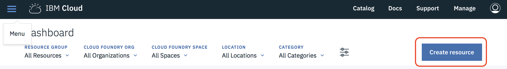
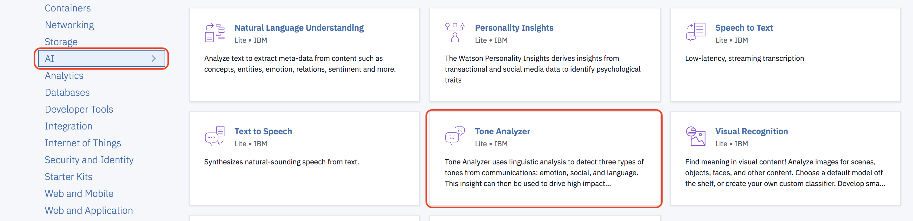
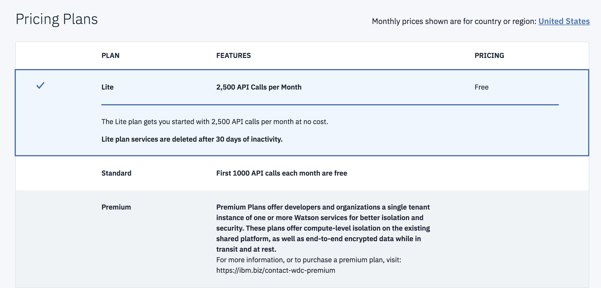
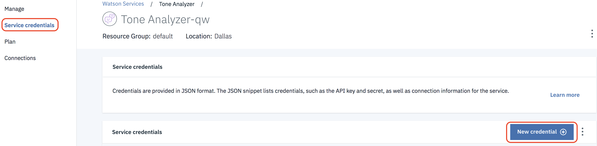
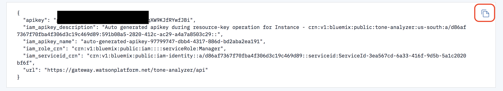
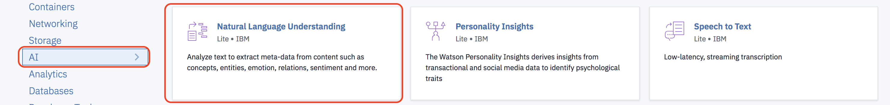
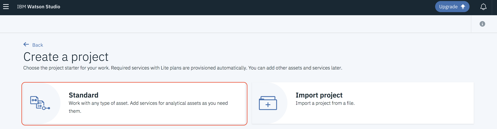
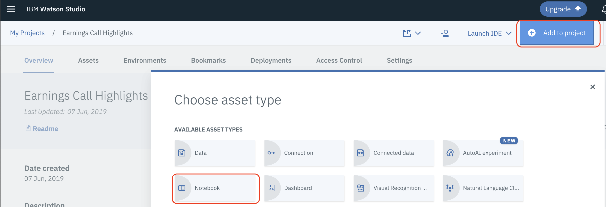
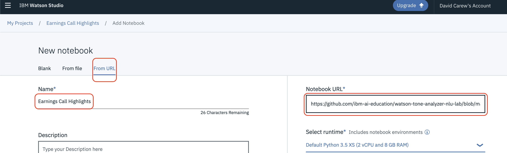
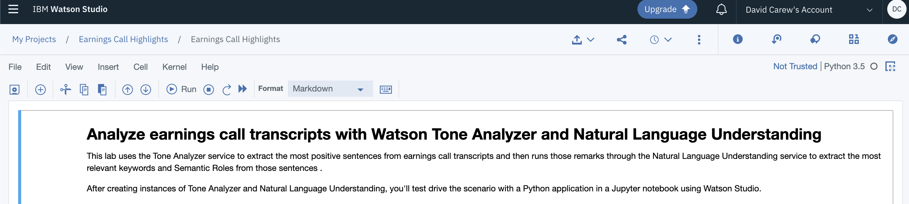

# Analyze earnings call transcripts with Watson Tone Analyzer and Natural Language Understanding

This lab uses the Tone Analyzer service to extract the highlights  from earnings call transcripts and then runs those remarks through the Natural Language Understanding  service to extract the most relevant keywords and Semantic Roles  from those  sentences .

In the context of earnings calls there is strong correlation between the amount  of joy measured by the Watson Tone Analyzer service and the highlights of the call. Further screening can be done using the output of the  NLU service to further categorize each highlight identified. 

After creating instances of Tone Analyzer and Natural Language Understanding, you'll test drive the scenario with a Python application in a Jupyter notebook using Watson Studio.

## 1. Setup

### 1.1 Sign up for IBM Cloud

If you are not already signed up for the IBM Cloud, [sign up here](https://cloud.ibm.com)

### 1.2 Sign up for Watson Studio

If you are not already signed up for Watson Studio, [sign up here](https://www.ibm.com/cloud/watson-studio)


### 1.2 Create an instance of the Watson Tone Analyzer Service

1.2.1 From the IBM Cloud Dashboard click on **Create resource**



1.2.2 Select the **AI** category project type and then click on **Tone Analyzer**


1.2.3 Make sure the **Lite plan** is selected and then click **Create**


1.2.4 Select **Service credentials** at the left and then click on **New credentials**


1.2.5 Accept the default values and click **Add**

1.2.6 Click on **View Credentials**

1.2.7 Click on the icon to copy the credentials to the clipboard and then save them in a text file on your Desktop (or some other convenient location). You'll need the **apikey** value later in the lab.


### 1.3 Create an instance of the Watson Natural Language Understanding Service

1.3.1 From the IBM Cloud Dashboard click on **Create resource**


1.3.2 Select the **AI** category project type and then click on **Natural Language Understanding**


1.3.3 Make sure the **Lite plan** is selected and then click **Create**


1.3.4 Select **Service credentials** at the left and then click on **New credentials** next to the credentials generated for your service instance

1.3.5 Accept the default values and click **Add**

1.3.6 Click on **View Credentials**

1.3.7 Click on the icon to copy the credentials to the clipboard and then save them in a text file on your Desktop (or some other convenient location). You'll need the **apikey** value later in the lab.

### 2. Create  and run this lab's notebook

2.1 Login to Watson Studio [https://dataplatform.cloud.ibm.com/](https://dataplatform.cloud.ibm.com/)

2.2 From the Watson Studio home page click on **Create a project**

2.3 Select a **Standard** project type and click **Create**


2.3 Name the project *Earnings Call Highlights*

2.4 if you already have an Object Storage  instance associated with your project, click **Create** and go to Step 2.8

2.5 Else click on **Add** to add an Object Storage instance to your Watson Studio Instance. This will be used to permanently store any data that you upload to Watson Studio

2.6 Accept the defaults, scroll down and click the **Create** button. Click **Confirm**.

2.7 Click **Refresh** to load the details of the new Object Storage instance and then click **Create**

2.8 Click on  **Add to project** and then select **Notebook**


2.3 Name the Notebook *Earnings Call Highlights* . Select **From URL** and copy the following URL into the **Notebook URL** field and then click **Create Notebook**

```
https://github.com/ibm-ai-education/watson-tone-analyzer-nlu-lab/raw/master/earnings-highlights.ipynb
```




2.4 After a few seconds the notebook should be loaded


2.4 Follow the instructions in the notebook to complete the exercise.

## Conclusion
Congratulations ! You successfully worked with both Tone Analyzer and NLU to start creating a framework to extract highlights from earnings call transcripts.
